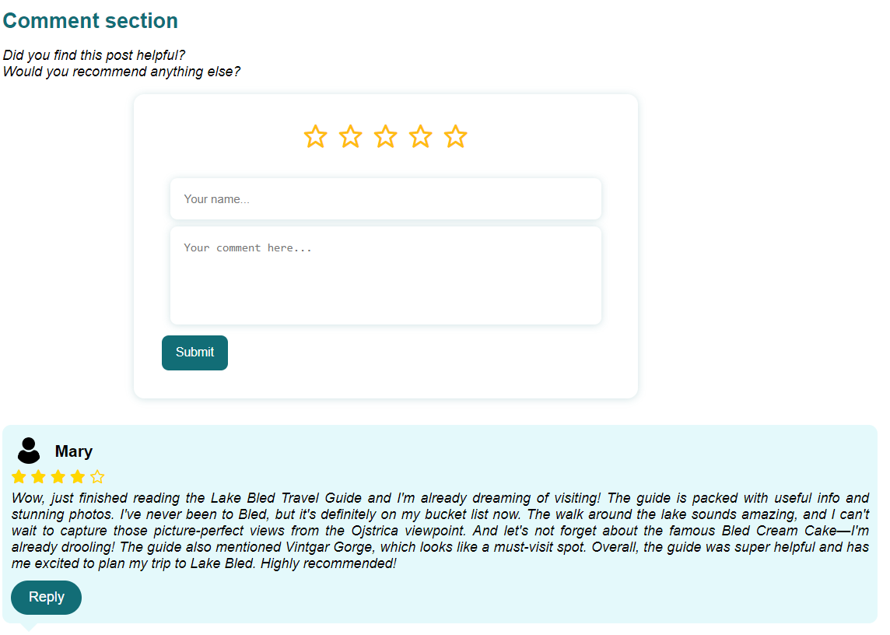

<!-- PROJECT SHIELDS -->
<div style="text-align: center;">

[](https://github.com/raquel-amaral18/Adventure_Atlas/graphs/contributors)
[](https://github.com/raquel-amaral18/Adventure_Atlas/issues)
[](https://github.com/raquel-amaral18/Adventure_Atlas/blob/main/LICENSE) 

</div>
<div style="text-align:center;">
    
</div>

<!-- ABOUT THE PROJECT -->
# Adventure Atlas

Adventure Atlas is a dynamic platform that allows you to share your unique travel experiences by uploading personalized travel guides. The platform also provides an interactive space where users can comment on travel guides, fostering a collaborative environment for exchanging tips and recommendations.

Adventure Atlas offers seamless navigation, allowing you to explore guides based on continents and specific types of travel experiences such as active adventures, luxury getaways, backpacking escapades, solo journeys, road trips, and more. 

Map your way to adventure with AdventureAtlas. Discover insider tips and hidden gems, created by travelers just like you. Customize your own map and share your adventures with the world.

Start mapping your adventures today!

<!-- TABLE OF CONTENTS -->
<details>
  <summary>Table of Contents</summary>
  <ol>
    <li>
      <a href="#Rush Hour: The Race">Rush Hour: The Race</a>
    </li>
    <li>
      <a href="#getting-started">Getting Started</a>
      <ul>
        <li><a href="#prerequisites">Prerequisites</a></li>
        <li><a href="#installation">Installation</a></li>
      </ul>
    </li>
    <li><a href="#How to Play">How to Play</a></li>
    <li><a href="#Power-Ups">Power-Ups</a></li>
    <li><a href="#Open Issues">Open Issues</a></li>
    <li><a href="#Game Designers">Game Designers</a></li>
    <li><a href="#license">License</a></li>
  </ol>
</details>

<!-- GETTING STARTED -->
## Getting Started

This is an example of how you can get a local copy of the site and run it on your computer

### Prerequisites
Before you begin, make sure you have the following:

- XAMPP installed on your machine, as Adventure Atlas relies on its server environment


### Installation

Please note that these instructions are tailored for Windows users. If you are using a different operating system, you may need to adapt the steps accordingly.

1. **Install XAMPP:**
    - Download and install XAMPP [here](https://www.apachefriends.org/).

2. **Clone the Repository:**
    - Open the Git terminal.
    - Navigate to the directory where you want to clone the repository using the `cd` command.
    - Run the following command to clone the repository:
     ```bash
     git clone https://github.com/raquel-amaral18/Adventure_Atlas.git
     ```

3. **Navigate to the Cloned Repository:**
   - Change to the directory of the cloned repository:
     ```bash
     cd Adventure_Atlas
     ```

4. **Copy the Final Project Folder:**
    - Copy the folder called `FinalProject`.

5. **Locate XAMPP's htdocs Directory:**
    - Navigate to the XAMPP installation directory, typically located at `C:\xampp` on Windows.
    - Inside the XAMPP directory, locate the `htdocs` folder. This is where your web applications are hosted.

6. **Move the Cloned Adventure Atlas Repository into the htdocs Folder:**
    - Open the `htdocs` folder.
    - Paste the previously copied `FinalProject` folder into the `htdocs` directory.

7. **Setting Up the Database:**
    - Copy the `AdventureAtlas.sql` file from the `FinalProject`folder.
    - Open XAMPP and start both Apache and MySQL services.
    - Access phpMyAdmin by visiting http://localhost/phpmyadmin in your web browser.
    - Create a new database named "AdventureAtlas".
    - Select the newly created database and import the `AdventureAtlas.sql` file.

8. **Access the Site:**
   - Start XAMPP (if you haven't already) and ensure both Apache and MySQL services are running.
   - Open your web browser and go to http://localhost/FinalProject/Main%20Page/MainPage.php.

Now you're ready to explore Adventure Atlas on your local machine!

<!-- USAGE EXAMPLES -->
## Usage Example

Explore the key features of Adventure Atlas and get started on your travel journey!

### 1. Home Page

The Adventure Atlas home page welcomes you with an interactive interface showcasing, for example, a preview of the three most recently uploaded travel guides. Here's a sneak peek:


### 2. Explore Guides by Continent and Type

Adventure Atlas allows you to explore guides based on continents and specific types of travel experiences:


### 3. Sign In / Log In

To contribute your travel guides, log in with your Adventure Atlas account. If you don't have an account, sign up to unlock the full potential of the platform.


### 4. Upload Your Travel Guides

Once logged in, navigate to the "Upload Your Travel Guides" section to share your travel experiences. Fill in the details, add captivating images, and let others embark on your adventure.


### 5. Admin Page (Approval Process)

For administrators, access the Admin Page to oversee and approve travel guides before they become visible to the public. Use the following credentials:

- **Username:** admin
- **Password:** 1234

 

### 6. Engage with the Community

Discover a vibrant community of fellow travelers by commenting on travel guides, sharing tips, and connecting with like-minded explorers.

 

Now that you have a glimpse of Adventure Atlas, start your journey and share your unique travel guides with the world!


<!-- CONTRIBUTING -->
## Contributors
This site was created as part of the course requirements for Technologies and Web Applications during the Spring semester 2022-2023. The project represents the collaborative effort of the following contributors:

- **Andreia Vieira**
  - *Student Number:* 20221944

- **Margarida Ourives**
  - *Student Number:* 20221809

- **Raquel Amaral**
  - *Student Number:* 20221844


<!-- LICENSE -->
## License

Distributed under the MIT License. See `LICENSE.txt` for more information.


